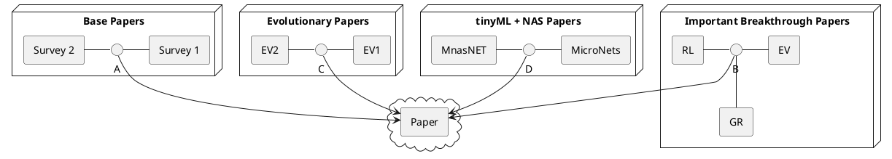

# Seminar-NAS

1. [Topic](#topic)
2. [Papers](#papers)
    1. [Main Papers](#cp)
    2. [Groups of Papers](#bp)
3. [Structure](#structure)
4. [Links](#links)

<a name="topic"/>

## 1. Topic

*NAS* using evolutionary algorithms with *RL* and goal attainment

Keywords:
- NAS
    - Network Architecture Search
    - Neural Architecture Search

- RL
    - Reinforcement Learning

- Goal Attainment
    - Selecting the fittest individuals

<a name="papers"/>

## 2. Papers

[Here](https://ml4aad.org/automl/literature-on-neural-architecture-search/), you can find a great database of all relevant
publications around NAS.

### 2.1 Main Papers
<table>
<tr>
  <th>Title</th>
  <th>Summary</th>
</tr>
<tr>
  <td> <a href="https://arxiv.org/abs/1611.01578">
  Neural Architecture Search: A Survey
  </a>
   
  Base Paper
  </td>
  <td>
  O.G. paper on the initial snapshot of NAS research.

   
   
  </ul>
  Cited 1540 times, 2019
  </td>
</tr>
<tr>
  <td> <a href="https://ieeexplore.ieee.org/abstract/document/9508774">
  A Survey on Evolutionary Neural Architecture Search
  </a>
   
  Base Paper
  </td>
  <td>
  More recent review/survey, specifically for Evolutionary methods!
   
   
  Cited 71 times, 2021
  </td>
</tr>
<tr>
  <td> <a href="http://proceedings.mlr.press/v70/real17a.html">
  Large-Scale Evolution of Image Classifiers
  </a>
   
  Evolutionary NAS
  </td>
  <td>
  One of the first notable evolutionary search space attempt for NAS.

   
   
  Cited 1294 times, 2017
  </td>
</tr>
<tr>
  <td>
   <a href="https://arxiv.org/abs/1611.01578">
      Neural Architecture Search with Reinforcement Learning
   </a>
    
   RL NAS (Origin)
  </td>
  <td>
  The first notable NAS paper, RL-based NAS.

   
   
  Cited 3979 times, 2017
  </td>
</tr>
<tr>
  <td> <a href="https://arxiv.org/abs/1806.09055">
  DARTS
  </a>
    
   Gradient-based NAS
  </td>
  <td>
  The first notable gradient-based NAS paper, reduced significantly GPU Days down to single digits.
   
   
  Cited  2568 times, 2018
  </td>
</tr>
<tr>
  <td> <a href="https://ojs.aaai.org/index.php/AAAI/article/view/4405">
  Regularized Evolution for Image Classifier Architecture Search
  </a>
   
  Evolutionary NAS
  </td>
  <td>
  Tournament selection evolutionary algorithm by introducing an age property to favor the
  younger genotypes.
   
   
  Cited  1973 times, 2019
  </td>
</tr>
<tr>
</table>

### 2.2 Groups of Papers
<table>
<tr>
  <th>Category</th>
  <th>Bundle of Papers</th>
</tr>
<tr>
  <td>
  TinyML +  NAS
  </td>
  <td>
  1. <a href="https://proceedings.neurips.cc/paper/2020/hash/86c51678350f656dcc7f490a43946ee5-Abstract.html">
  MCUNet: Tiny Deep Learning on IoT Devices
  </a>  
  2. <a href="https://openaccess.thecvf.com/content_CVPR_2019/html/Tan_MnasNet_Platform-Aware_Neural_Architecture_Search_for_Mobile_CVPR_2019_paper">
  MnasNet: Platform-Aware Neural Architecture Search for Mobile
  </a>  
  3. <a href="https://arxiv.org/abs/2010.11267">
  MicroNets: Neural Network Architectures for Deploying TinyML Applications on Commodity Microcontrollers
  </a>  
  4. <a href="https://ieeexplore.ieee.org/abstract/document/9634749">
  Tiny neural network search and implementation for embedded FPGA: a software-hardware co-design approach
  </a>  
  5. <a href="https://arxiv.org/abs/2103.00363">
  Tiny Adversarial Mulit-Objective Oneshot Neural Architecture Search
  </a>  
  </td>
</tr>
<tr>
  <td>
  NAS with Cells
  </td>
  <td>
  1. <a href="https://openaccess.thecvf.com/content_cvpr_2018/html/Zoph_Learning_Transferable_Architectures_CVPR_2018_paper.html">
  Learning Transferable Architectures for Scalable Image Recognition
  </a>  
  2. <a href="https://proceedings.mlr.press/v80/cai18a.html">
  Path-Level Network Transformation for Efficient Architecture Search
  </a>  
  3. <a href="https://ojs.aaai.org/index.php/AAAI/article/view/4405">
  Regularized Evolution for Image Classifier Architecture Search
  </a>  
  </td>
</tr>
<tr>
  <td>
  NAS with Blocks
  </td>
  <td>
  1. <a href="https://ieeexplore.ieee.org/abstract/document/8742788">
  Learning Transferable Architectures for Scalable Image Recognition
  </a>  
  2. <a href="https://ieeexplore.ieee.org/abstract/document/8914267">
  Auto-creation of Effective Neural Network Architecture by Evolutionary Algorithm and ResNet for Image Classification
  </a>  
  3. <a href="https://ojs.aaai.org/index.php/AAAI/article/view/6877">
  Efficient Residual Dense Block Search for Image Super-Resolution
  </a>  
  </td>
</tr>
<tr>
  <td>
  Micro-Architecture Optimization
  </td>
  <td>
  1. <a href="https://ojs.aaai.org/index.php/AAAI/article/view/4405">
  Regularized Evolution for Image Classifier Architecture Search
  </a>  
  </td>
</tr>
<tr>
  <td>
  Rich Initialization
  </td>
  <td>
  1. <a href="https://ieeexplore.ieee.org/abstract/document/8023302">
  Deep convolutional networks for human sketches by means of the evolutionary deep learning
  </a>  
  </td>
</tr>
</table>

<a name="structure"/>

## 3. Paper Structure

<a name="notebook"/>

## 4. Links
- [Literature on NAS](https://ml4aad.org/automl/literature-on-neural-architecture-search/)
  - Database
- [Microsoft Research NAS Lecture](https://www.youtube.com/watch?v=wL-p5cjDG64):
  - Great video on NAS, heavily based on the 2019 Survey Paper!
- [Microsoft Research: NAS Directions](https://www.youtube.com/watch?v=BAtBwgV1fG0)
  - Great video on possible NAS directions and what tools are used around it

## Questions

- [ ] Question
  - R: Reply
