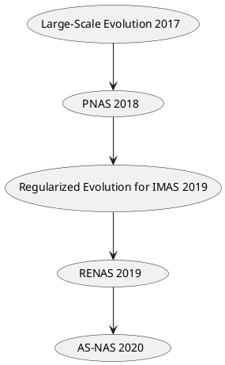

# Seminar-NAS

1. [Topic](#topic)
2. [Papers](#papers)
    1. [Chosen Papers](#cp)
    2. [Possible Papers](#bp)
3. [Notebook](#notebook)
    1. [NAS](#nas)
    2. [Evolutionary Algorithms](#ea)
4. [Links](#links)

<a name="topic"/>

## 1. Topic

*NAS* using evolutionary algorithms with *RL* and goal attainment

Keywords:
- NAS
    - Network Architecture Search
    - Neural Architecture Search

- RL
    - Reinforcement Learning

- Goal Attainment
    - Selecting the fittest individuals

<a name="papers"/>

## 2. Papers

[Here](https://ml4aad.org/automl/literature-on-neural-architecture-search/) you can find a great database of all relevant
publications around NAS.

### 2.1 Chosen Papers (For the Survey)
<table>
<tr>
  <th>Title</th>
  <th>Summary</th>
</tr>
<tr>
  <td> <a href="http://proceedings.mlr.press/v70/real17a.html">
  Large-Scale Evolution of Image Classifiers
  </a>
   
  &#9889 Search: Evolutionary
   
  &#127936 Base Paper
  </td>
  <td>
  One of the first notable evolutionary search space attempt for NAS.

   
   
  Cited 1294 times, 2017
  </td>
</tr>
<tr>
  <td> <a href="https://arxiv.org/abs/1611.01578">
  Neural Architecture Search: A Survey
  </a>
   
  &#9200 Survey
   
  &#127936 Base Paper
  </td>
  <td>
  Evaluates NAS as sub-field of Auto-ML and surveys the field as of the current
  state of the art during the publication of said paper. Also breaks down the main
  methods within NAS and shows what options exist to mix and match them. A great starting point
  to learn about this field!

   
   
  <ul>Questions
  <li>
  ?
  </li>
  </ul>
  Cited 1540 times, 2019
  </td>
</tr>
<tr>
  <td>
    <a href="https://arxiv.org/abs/1611.01578">
      Neural Architecture Search with Reinforcement Learning
    </a> (Zoph and Lee 2017)
     
    &#9889  Search: RL
  </td>
  <td>
  Paper that sparked Neural Architecture Search to the mainstream. They obtained competetive performance on the
  CIFAR 10 and Penn Treebank benchmarks with a search strategy based on reinforcement learning. Vast computational
  resources were necessary: 800 GPUs for 3 to 4 Weeks. Future efforts were made on top of this paper to reduce computational
  costs and improve performance.

   
   
  <ul>Questions
  <li>
  RNN as controller, provides flexible method, then able to search variable-length architecture space.
  What is that?
  </li>
  </ul>
  Cited 3979 times, 2017
  </td>
</tr>
<tr>
  <td>
    <a href="https://arxiv.org/pdf/1802.03268.pdf">
      Efficient Neural Architecture Search via Parameters Sharing
    </a>
    (Hieu Pham, Melody Y. Guan, Barret Zoph, Quoc V. Le, Jeff Dean 2018)
     
    &#9889  Search: RL
  </td>
  <td>
  Reduced computation costs significantly in comparison to Zoph and Lee. Search takes less than 16 hours and have a lower test error on CIFAR-10. Trick is to share computations among experiments. All with one desktop GPU. The time consuming step was training/sampling all childs in parallel. Here the different networks are trained "together" and share the same weights (somehow it works). Also another trick is to
use/inject prior human knowledge to fix "macros" AKA basically giving an initial skeleton of the architecture, making the search space smaller with less degrees of freedom. Then they do a "micro search" which is basically searching within cells themselves instead of varying different architecture compositions etc.

   
   
  Cited 1971 times, 2018
  </td>
</tr>
<tr>
  <td> <a href="https://openaccess.thecvf.com/content_ECCV_2018/html/Chenxi_Liu_Progressive_Neural_Architecture_ECCV_2018_paper.html">
  Progressive Neural Architecture Search
  </a>
  (Chenxi Liu, Barret Zoph, Maxim Neumann, Jonathon Shlens, Wei Hua, Li-Jia Li, Li Fei-Fei, Alan Yuille, Jonathan Huang, Kevin Murphy 2018)
     
    &#9889 Search: Evolutionary
  </td>
  <td>
  No controller, No RL. They grow networks using algorithms based on genetic/evolutionary algos. Simple procedure, search time is much much lower than NASNet. Performance is okay.

   
   
  Cited 1510 times, 2018
  </td>
</tr>
<tr>
  <td> <a href="https://arxiv.org/abs/1806.09055">
  DARTS
  </a>
  (Hanxiao Liu, Karen Simonyan, Yiming Yang 2018)
     
    &#9889 Search: Discrete Derivative Problem / Gradient-based
  </td>
  <td>
  No controller, No intermediate performance prediciton which may cause diversion.
  Outperforms everything before it and achieves state of the art on Cifar 10. Continuous relaxation
  of a discrete search problem. Does mostly cell (micro) search!
   
   
  &#9989 Very Promising! Exposes RL as a very slow search space method for NAS!
   
   
  &#9940 Reread this! Complicated

   
   
  Cited  2568 times, 2018
  </td>
</tr>
<tr>
  <td> <a href="https://arxiv.org/abs/1806.09055">
  RENAS: Reinforced Evolutionary Architecture Search
  </a>
  (Yukang Chen, Gaofeng Meng, Qian Zhang, Shiming Xiang, Chang Huang, Lisen Mu, Xinggang Wang 2019)
     
    &#9889 Search: Evolutionary
  </td>
  <td>
  RENAS, which is an evolutionary method with reinforced mutation for NAS. It addresses the high
  computation methods that are present in the NAS space with the intent to diminish
   
   
  &#9989 Evo. Algos. and has competetive performance to CIFAR-10

   
   
  &#9940 For some reason not as cited as I thought it would be

   
   
  Cited  82 times, 2019, highest paper that cited it was 180
  </td>
</tr>
<tr>
  <td> <a href="https://ojs.aaai.org/index.php/AAAI/article/view/4405">
  Regularized Evolution for Image Classifier Architecture Search
  </a>
  (Esteban Real, Alok Aggarwal, Yanping Huang, Quoc V.Le 2019)
     
    &#9889 Search: Evolutionary
  </td>
  <td>
  ...
   
   
  Cited  1973 times, 2019
  </td>
</tr>
<tr>
  <td> <a href="https://ojs.aaai.org/index.php/AAAI/article/view/4405">
  AS-NAS: Adaptive Scalable Neural Architecture Search With Reinforced Evolutionary Algorithm for Deep Learning
  </a>
  (...)
     
    &#9889 Search: Evolutionary and RL
  </td>
  <td>
Unlike the typical reinforcement learning (RL)-based and evolutionary algorithm (EA)-based NAS methods, a simplified RL algorithm is developed and used as the reinforced operator controller to adaptively select the efficient operators of IDEA. Without the complex actor–critic parts, the reinforced IDEA based on simplified RL can enhance the search efficiency of the original EA with lower computational cost
   
   
  Cited  19 times, 2020
  </td>
</tr>
<tr>
  <td> <a href="https://ieeexplore.ieee.org/abstract/document/9508774">
  A Survey on Evolutionary Neural Architecture Search
  </a> (Yuqiao Liu, Yanan Sun, Bing Xue, Mengjie Zhang, Gary G. Yen, Kay Chen Tan 2021)
   
  &#9200 Survey
  </td>
  <td>
  More recent review/survey, specifically for Evolutionary methods!

   
   
  Cited 71 times, 2021
  </td>
</tr>
<tr>
  <td> <a href="https://arxiv.org/abs/1905.01392">
  A genetic mixed‑integer optimization of neural network hyper‑parameters
  </a> (Kyle Spurlock, Heba Elgazzar 2022)
     
    &#9889 Search: Evolutionary
  </td>
  <td>
 A common NAS approach is the genetic
algorithm (GA); however, its usage is often exclusively tied to either the learnable
parameters, or the meta-parameters that augment the learning. This work proposes
an experimental approach for optimizing both real-valued weights and discrete
meta-parameters simultaneously. Experimental results have shown that the current
approach evolves both parameter sets effectively for simple problems like Iris, but
still struggles in finding an optimal model for more rigorous problems.
   
   
  &#9940 Cited 0 times, but is new

   
   
  Cited 0 times, 2022
  </td>
</tr>
<tr>
  <td> <a href="http://www.ijnc.org/index.php/ijnc/article/view/276">
  Neural Architecture Search based on Genetic Algorithm and Deployed in a Bare-Metal Kubernetes Cluster
  </a> (Andreas Klos, Marius Rosenbaum, Wolfram Schiffmann)
     
    &#9889 Search: Evolutionary
  </td>
  <td>
Scalable and highly available multi-objective Neural Architecture Search and adopted it to the modern thinking of developing applications by subdividing an already existing, monolithic approach – based on a Genetic Algorithm – into microservices. Moreover, we adjusted the initial population creation by mutating each individual 1,000 times, extended the approach by inception layers, implemented it as island model and achieved on MNIST, Fashion-MNIST and CIFAR-10 dataset 99.75%, 94.35% and 89.90% test accuracy, respectively. Also addresses high computation costs within NAS.
   
   
  &#9940 Cited 0 times, but is new

   
   
  Cited 0 times, 2022
  </td>
</tr>
<tr>
  <td> <a href="https://dl.acm.org/doi/10.1145/3491396.3506510">
  A Training-free Genetic Neural Architecture Search
  </a> (Meng-Ting Wu, Hung-I Lin, Chun-Wei Tsai)
     
    &#9889 Search: Evolutionary
  </td>
  <td>
  Presents an efficient NAS in this study, called genetic algorithm and noise immunity for neural architecture search without training (GA-NINASWOT).
   
   
  Simulation results show that GA-NINASWOT outperforms all the other state-of-the-art weight-sharing methods and NASWOT compared in this study in terms of the accuracy and computational time. Moreover, GA-NINASWOT gives a result that is comparable to those found by the non-weight-sharing methods while reducing 99% of the search time.
   
   
  &#9940 Cited 0 times, but is new

   
   
  Cited 0 times, 2022
  </td>
</tr>
<tr>
  <td> <a href="https://dl.acm.org/doi/10.1145/3491396.3506510">
CURIOUS: Efficient Neural Architecture Search Based on a Performance Predictor and Evolutionary Search
  </a> (Shayan Hassantabar, Xiaoliang Dai, Niraj K. Jha 2022)
     
    &#9889 Search: Evolutionary
  </td>
  <td>
To address challenges such as high computational costs for RL-based searches, we propose the CURIOUS NN synthesis methodology. It uses a performance predictor to efficiently navigate the architectural search space with an evolutionary search process. The predictor is built using quasi Monte-Carlo sampling, boosted decision tree regression, and an intelligent iterative sampling method. It is designed to be sample-efficient. CURIOUS starts from a base architecture and explores the architectural search space to obtain a variant of the base architecture with the highest performance.
   
   
  &#9940 Cited 0 times, but is new

   
   
  Cited 0 times, 2022
  </td>
</tr>
<tr>
<tr>
  <td> <a href="https://arxiv.org/abs/1905.01392">
  A Survey on Neural Architecture Search
  </a> (Martin Wistuba, Ambrish Rawat, Tejaswini Pedapati 2019)
   
  &#9200 Survey
  </td>
  <td>
  More recent review/survey

   
   
  Cited 178 times, 2019
  </td>
</tr>
<tr>
</table>

### 2.2 Possible Papers
<table>
<tr>
  <th>Title</th>
  <th>Summary</th>
</tr>
<tr>
  <td> <a href="https://www.mdpi.com/2079-9268/12/1/2">
  A Framework for Ultra Low-Power Hardware Accelerators  
  Using NNs for Embedded Time Series Classification
  </a> (...) </td>
  <td>
Presents a novel framework that allows an end-to-end ASIC implementation of a low-power hardware for time series classification using NNs. This includes a neural architecture search (NAS), which optimizes the NN configuration for accuracy and energy efficiency at the same time
   
   
  &#9940 Not cited, not even once

   
   
  Cited 0 times, 2021
  </td>
</tr>
<tr>
  <td> <a href="https://dl.acm.org/doi/10.1145/3486618">
Enable Deep Learning on Mobile Devices: Methods, Systems, and Applications
  </a> (...) </td>
  <td>
  Uses NAS alongside other model compression methods such as pruning, factorization, quantization as well as compact model design. Also uses automated pruning and quantization. Done to enable the use of complex deep learning methods on resource constrained devices such as mobile phones and IoT devices.
   
   
  &#9940 Not cited

   
   
  Cited 0 times, 2022
  </td>
</tr>
<tr>
  <td> <a href="https://www.sciencedirect.com/science/article/abs/pii/S0925231221018439?via%3Dihub">
  A Review of Neural Architecture Search
  </a>
  (Dilyara Baymurzinaa, Eugene Golikova, Mikhail Burtsev 2022)
   
  &#9200 Survey
  </td>
  <td>
  More recent review/survey

   
   
  Cited 2 times, 2021/2022
  </td>
</tr>
</table>

<a name="notebook"/>

## 3. Notebook
### 3.1 NAS ([link](https://www.youtube.com/watch?v=wL-p5cjDG64))
#### NAS; Dimensions
NAS Methods can be categorized/differentiated by three dimensions:
1. `Search Space`
    - Defines which architectures can be represented. Incorporating prior knowledge reduces.
    - Problem: Even with constrains, remains i) non-continuous and ii) high dimensional
    search space size (good), however it also introduces bias (bad).
2. `Search Strategy`
    - premature convergence vs find well performing architectures quickly (exploration-exploitation trade off)
    - examples of strategies: random search, Bayesian optimization, evolutionary methods, RL and gradient based
    methods.
3. `Performance Estimation Strategy`
    - Standard training and validation is computationally expensive and limits
    the number of architectures that can be explored.
    - However, training each architecture to be evaluated from scratch frequently yields computational demands in the order
    of thousand of GPU days.
    - Naturally this created the need to develop methods for speeing up performance estimation which is done in this
    section of the process/dimension.
    - Speed-up Methods:
        - Lower fidelity estimates
        - learning curve extrapolation
        - weight inheritance/Network Morphisms
        - One-Shot Models/Weight Sharing

#### Nas Timeline
1. `RL`: They framed NAS as an interaction problem, as they do not know the transitions
among the search space and also have differentiable rewards. This gives some reason to
frame NAS as an RL problem with usage of policy gradient to fine tune the parameters.
This was done in 1. and 2.

2. `Evolutionary`: Done in 3.
3. `Continuous relaxation of a discrete search / gradient based`. : Done in 4.

##### 1. Zoph and Lee (2017), used 8000 GPUs
- Posed as a policy gradient/RL problem: (Not good)
- The controller (RNN) is the policy in itself, it samples architectures with probability P and trains a child arch.
- 8000 GPUs, 6 months
- beat human architectures in an automated fashion, kickstarted NAS

##### 2. ENAS - Efficient NAS
- Reduced computation costs significantly in comparison to Zoph and Lee.
- Search takes less than 16 hours and have a lower test error on CIFAR-10.
- One of the tricks is to share computations among experiments.
- All with one desktop GPU.

##### 3. Progressive Neural Architecture Search
- Grows networks, no controller, no RL.
- Similar to Genetic/Evolutionary Algorithms, fit parents are passed along, mutation, etc
- Use intermediate performance predictors to predict performance and save time training layers until
the end.

##### 4. DARTS
- No controllers, no intermediate performance prediction
- outperforms everything else before it
- Doesn't cast NAS as an RL problem
- Continuous relaxation of a discrete search problem.
- Does mostly cell (micro) search!

[First Video](https://www.youtube.com/watch?v=wL-p5cjDG64)

[Second Video](https://www.youtube.com/watch?v=BAtBwgV1fG0)

### 3.2 Evolutionary Algorithms ([link](https://www.youtube.com/watch?v=CZE86BPDqCI))
Based on the biological principal of natural selection.

Process:
- Establish population of control laws
- Let theme compete, see how effective they are and rate them based on their fitness
- Breed the "next-generation" of control laws based on the most effective ones

Notes:
- Miller et al. 1989: First used genetic algorithms to propose architectures and use backpropagation to
optimize their weights.
- Nowadays SGD-based weight optimization outperform raw evolutionary ones, however the evolutionary algorithms
are still used to propose new architectures / optimize the current architecture.
- Ev. Algorithms mutations in this context are local operations such as adding or removing a layer, altering the hyperparameters
of a layer, adding skip connections, as well as altering training hyperparameters. After training the offsprings, their fitness
is evaluated and they are added to the population.

## 4. Links
