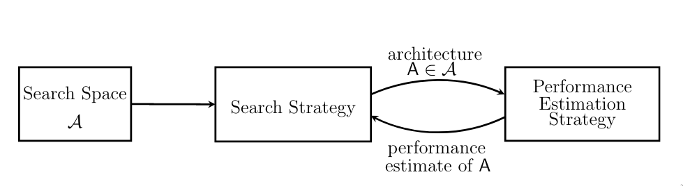
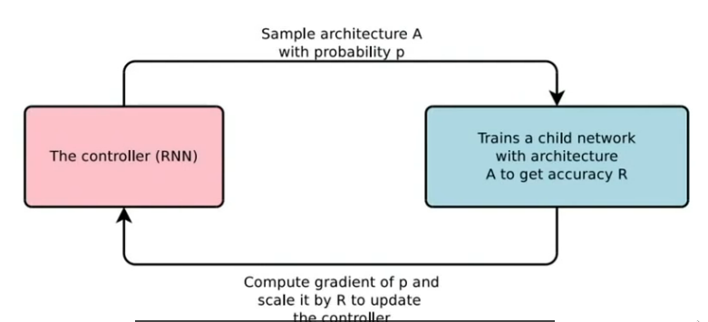

# Seminar-NAS

1. [Topic](#topic)
2. [Papers](#papers)
    1. [Base Papers](#bp)
    2. [Chosen Papers](#cp)
3. [Notebook](#notebook)
    1. [NAS](#nas)
    2. [Reinforcement Learning](#rl)
    3. [Evolutionary Algorithms](#ea)
4. [Links](#links)

<a name="topic"/>

## 1. Topic

*NAS* using evolutionary algorithms with *RL* and goal attainment

Keywords:
- NAS
    - Network Architecture Search
    - Neural Architecture Search

- RL
    - Reinforcement Learning

- Goal Attainment
    - Selecting the fittest individuals


<a name="papers"/>

## 2. Papers

[Here](https://ml4aad.org/automl/literature-on-neural-architecture-search/) you can find a great database of all relevant
publications around NAS.

### 2.1 Base Papers
<table>
<tr>
  <th>Title</th>
  <th>Summary</th>
</tr>
<tr>
  <td> <a href="https://arxiv.org/abs/1611.01578">
  Neural Architecture Search with Reinforcement Learning
  </a> (Zoph and Lee 2017) </td>
  <td>
  Paper that sparked Neural Architecture Search to the mainstream. They obtained competetive performance on the
  CIFAR 10 and Penn Treebank benchmarks with a search strategy based on reinforcement learning. Vast computational
  resources were necessary: 800 GPUs for 3 to 4 Weeks. Future efforts were made on top of this paper to reduce computational
  costs and improve performance.

  <br>
  <br>
  <ul>Questions
  <li>
  RNN as controller, provides flexible method, then able to search variable-length architecture space.
  What is that?
  </li>
  </ul>
  Cited 3979 times, 2017
  </td>
</tr>
<tr>
  <td>   </td>
  <td>   </td>
</tr>
</table>

### 2.2 Chosen Papers (For the Survey)
<table>
<tr>
  <th>Title</th>
  <th>Summary</th>
</tr>
<tr>
  <td> <a href="https://arxiv.org/abs/1611.01578">
  Neural Architecture Search: A Survey
  </a> </td>
  <td>
  Evaluates NAS as sub-field of Auto-ML and surveys the field as of the current
  state of the art during the publication of said paper. Also breaks down the main
  methods within NAS and shows what options exist to mix and match them. A great starting point
  to learn about this field!

  <br>
  <br>
  <ul>Questions
  <li>
  ?
  </li>
  </ul>
  Cited 1540 times, 2019
  </td>
</tr>
<tr>
  <td> <a href="https://arxiv.org/abs/1611.01578">
  Neural Architecture Search with Reinforcement Learning
  </a> (Zoph and Lee 2017) </td>
  <td>
  Paper that sparked Neural Architecture Search to the mainstream. They obtained competetive performance on the
  CIFAR 10 and Penn Treebank benchmarks with a search strategy based on reinforcement learning. Vast computational
  resources were necessary: 800 GPUs for 3 to 4 Weeks. Future efforts were made on top of this paper to reduce computational
  costs and improve performance.

  <br>
  <br>
  <ul>Questions
  <li>
  RNN as controller, provides flexible method, then able to search variable-length architecture space.
  What is that?
  </li>
  </ul>
  Cited 3979 times, 2017
  </td>
</tr>
<tr>
  <td> <a href="https://arxiv.org/pdf/1802.03268.pdf">
  Efficient Neural Architecture Search via Parameters Sharing
  </a> (Hieu Pham, Melody Y. Guan, Barret Zoph, Quoc V. Le, Jeff Dean 2018) </td>
  <td>
  Reduced computation costs significantly in comparison to Zoph and Lee. Search takes less than 16 hours and have a lower test error on CIFAR-10. Trick is to share computations among experiments. All with one desktop GPU. The time consuming step was training/sampling all childs in parallel. Here the different networks are trained "together" and share the same weights (somehow it works).

  <br>
  <br>
  Cited 1971 times, 2018
  </td>
</tr>
<tr>
  <td> <a href="https://www.sciencedirect.com/science/article/abs/pii/S0925231221018439?via%3Dihub">
  A Review of Neural Architecture Search
  </a> (Dilyara Baymurzinaa, Eugene Golikova, Mikhail Burtsev) </td>
  <td>
  More recent review/survey

  <br>
  <br>
  Cited 2 times, 2021/2022
  </td>
</tr>
</table>


<a name="notebook"/>

## 3. Notebook
### 3.1 NAS ([link](https://www.youtube.com/watch?v=wL-p5cjDG64))
#### NAS; Dimensions
NAS Methods can be categorized/differentiated by three dimensions:
1. `Search Space`
    - Defines which architectures can be represented. Incorporating prior knowledge reduces.
    - Problem: Even with constrains, remains i) non-continuous and ii) high dimensional
    search space size (good), however it also introduces bias (bad).
2. `Search Strategy`
    - premature convergence vs find well performing architectures quickly (exploration-exploitation trade off)
    - examples of strategies: random search, Bayesian optimization, evolutionary methods, RL and gradient based
    methods.
3. `Performance Estimation Strategy`
    - Standard training and validation is computationally expensive and limits
    the number of architectures that can be explored.
    - However, training each architecture to be evaluated from scratch frequently yields computational demands in the order
    of thousand of GPU days.
    - Naturally this created the need to develop methods for speeing up performance estimation which is done in this
    section of the process/dimension.
    - Speed-up Methods:
        - Lower fidelity estimates
        - learning curve extrapolation
        - weight inheritance/Network Morphisms
        - One-Shot Models/Weight Sharing



#### Nas Timeline
##### 1. Zoph and Lee (2017), used 8000 GPUs
- Posed as a policy gradient/RL problem: (Not good)
- The controller (RNN) is the policy in itself, it samples architectures with probability P and trains a child arch.
- 8000 GPUs, 6 months
- beat human architectures in an automated fashion, kickstarted NAS



##### 2. ENAS - Efficient NAS


#### [Notes from MR Lecture](https://www.youtube.com/watch?v=wL-p5cjDG64):
1. ResNet - found out about skip connections and identity learning


### 3.2 Reinforcement Learning ([link](https://www.youtube.com/watch?v=0MNVhXEX9to))
A branch of ML that can be seen as a framework for learning how to interact with the environment
from experience.

- Ocasionally, very ocasionally gets a reward
- Is in its core an optimization problem, where we aim to find the optimal policy set.

```

       ------------------------------------------
       |                                        |
       | Reward: r                              |
       v                                        |
----------------------                          |
|    Agent           |----------------->  ENVIRONMENT
|    Policy: p(s, a) |    Action: a             |
----------------------                          |
        ^                                       |
        |            State: s                   |
        ----------------------------------------

            Value Function: Vpi(s)

```
Value Function:
- Expected Reward I'd get in the future if I start at that state(s) and I enact
  that policy(pi)

- Computes the value of being in a certain state(s) given a policy(pi).


### 3.3 Evolutionary Algorithms ([link](https://www.youtube.com/watch?v=CZE86BPDqCI))
Based on the biological principal of natural selection.

Process:
- Establish population of control laws
- Let theme compete, see how effective they are and rate them based on their fitness
- Breed the "next-generation" of control laws based on the most effective ones

Notes:
- Miller et al. 1989: First used genetic algorithms to propose architectures and use backpropagation to
optimize their weights.
- Nowadays SGD-based weight optimization outperform raw evolutionary ones, however the evolutionary algorithms
are still used to propose new architectures / optimize the current architecture.
- Ev. Algorithms mutations in this context are local operations such as adding or removing a layer, altering the hyperparameters
of a layer, adding skip connections, as well as altering training hyperparameters. After training the offsprings, their fitness
is evaluated and they are added to the population.


## 4. Links
